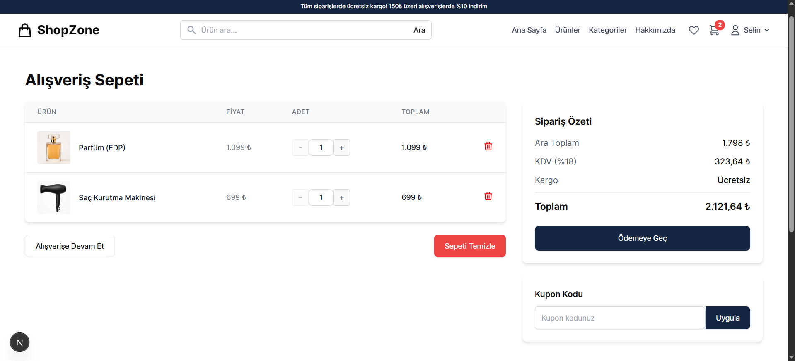

<div align="center">

# E-Ticaret Platformu (Next.js 14 + Express.js + MongoDB)

Modern, ölçeklenebilir ve kullanıcı dostu bir e-ticaret platformu. Müşteri tarafında hızlı ürün keşfi ve satın alma deneyimi; admin tarafında pratik yönetim ekranları ve temel öneri motoru içerir.

</div>

## İçindekiler

- Genel Bakış
- Teknoloji Yığını
- Mimarî ve Dizin Yapısı
- Kurulum ve Çalıştırma
- Ortam Değişkenleri
- Görsellerin Yönetimi ve URL Kuralları
- Öne Çıkan Alanlar ve Özellikler
- Öneri Sistemi (Popüler/İlgili/Geçmiş/ Birlikte Alınanlar)
- Admin Paneli (Toplu İşlemler dahil)
- API Uç Noktaları (Özet)
- Ekran Görüntüleri
- Sık Karşılaşılan Sorunlar ve Çözümler
- Lisans

## Genel Bakış

## Teknoloji Yığını

### Frontend

- Next.js 14+ (App Router)
- TypeScript
- Tailwind CSS
- Redux Toolkit
- React Hook Form + Zod
- Özel UI Bileşenleri

### Backend

- Node.js 18+ ve Express.js (TypeScript)
- MongoDB + Mongoose
- JWT Authentication
- Multer (Dosya Yükleme)
- Zod (Validation)
- Nodemailer
- bcrypt, CORS, Rate Limiting

## Mimarî ve Dizin Yapısı

```
/
├── backend/
│   ├── src/
│   │   ├── config/        # Env, DB, swagger
│   │   ├── controllers/   # İş mantığı
│   │   ├── middlewares/   # Auth, validation, error, rate limit
│   │   ├── models/        # Mongoose şemaları
│   │   ├── routes/        # REST uçları
│   │   ├── utils/         # jwt, email, upload, seeder, ensureAdmin
│   │   └── validations/   # Zod şemaları
│   └── uploads/
│       └── images/        # Statik görseller (products/categories)
├── frontend/
│   ├── public/            # Statik frontend asset’leri
│   └── src/
│       ├── app/           # App Router sayfaları
│       ├── components/    # UI ve domain bileşenleri
│       ├── hooks/         # useProductTracking vb.
│       ├── lib/           # getAssetUrl vb.
│       ├── services/      # Axios tabanlı API servisleri
│       ├── store/         # Redux Toolkit
│       └── types/         # TS tipleri
└── docs/
    └── screenshots/       # README içinde kullanılacak ekran görüntüleri
```

## Kurulum ve Çalıştırma

### Önkoşullar

- Node.js 18+
- MongoDB (lokal veya bulut)

### Backend

```
cd backend
npm install
```

.env dosyasını oluştur (aşağıdaki “Ortam Değişkenleri” bölümüne bak) ve geliştirici sunucusunu başlat:

```
npm run dev
```

Opsiyonel yardımcı komutlar (varsa):

- Admin kullanıcıyı garantiye al: `npm run ensure:admin`
- Örnek ürün/kategori seed: `npm run seed` veya proje içinde sağlanan özel seed script’leri

### Frontend

```
cd frontend
npm install
```

`.env.local` oluştur (aşağıya bak) ve başlat:

```
npm run dev
```

Uygulama: `http://localhost:3000`
API: `http://localhost:5000/api`

## Ortam Değişkenleri

### Backend (.env)

```
PORT=5000
NODE_ENV=development
MONGODB_URI=mongodb://localhost:27017/ecommerce
JWT_SECRET=your_jwt_secret_key_here
JWT_EXPIRES_IN=7d
SMTP_HOST=smtp.example.com
SMTP_PORT=587
SMTP_USER=your_email@example.com
SMTP_PASS=your_email_password
EMAIL_FROM=noreply@ecommerce.com
UPLOAD_PATH=uploads/
MAX_FILE_SIZE=5242880
FRONTEND_URL=http://localhost:3000
```

### Frontend (.env.local)

```
NEXT_PUBLIC_API_URL=http://localhost:5000/api
NEXT_PUBLIC_ASSETS_BASE_URL=http://localhost:5000
```

Not: Next.js Image için `next.config.ts` içerisinde `images.domains` ve `remotePatterns` alanlarında `localhost:5000` ve `127.0.0.1:5000` tanımlıdır.

## Görsellerin Yönetimi ve URL Kuralları

- Backend statik servis: `backend/src/index.ts` içinde `/images` route’u `uploads/images` klasörüne bağlıdır.
- Ürün görselleri: `backend/uploads/images/products/<category-slug>/<file>.jpg`
- Kategori görselleri: `backend/uploads/images/categories/<file>.jpg`
- Frontend’te asset yolu dönüştürme: `getAssetUrl(path)` (`frontend/src/lib/utils.ts`)

## Öne Çıkan Alanlar ve Özellikler

- Ana sayfa hero, popüler kategoriler ve “Öne Çıkan Ürünler” alanı
  - “Öne Çıkan Ürünler” etkinlik tabanlı popüler ürünlerden gelir; boşsa “Yeni Gelenler” fallback.
- Ürün listesi: filtreleme, arama, sıralama, sayfalama
- Ürün detay: görseller, puanlama, yorumlar, ilgili ürünler
- Sepet, ödeme akışı (dummy payment) ve sipariş oluşturma
- Kullanıcı: profil, adres yönetimi, wishlist
- Admin: ürün/kategori/sipariş/müşteri/yorum yönetimi
  - Toplu işlemler: aktif/pasif/öne çıkar, “Kategori Ata” (dropdown ile), toplu silme
  - Kategori listesi: durum filtresi, arama, toplam kayıt göstergesi

## Öneri Sistemi

- Aktivite log modeli ile `view` ve `purchase` kayıtları tutulur.
- Uç noktalar:
  - Popüler ürünler: `GET /api/recommendations/popular?limit=8&days=30`
  - İlgili ürünler: `GET /api/recommendations/related/:productId`
  - Geçmişe göre öneriler (giriş gerekli): `GET /api/recommendations/history`
  - Birlikte sıkça alınanlar: `GET /api/recommendations/frequently-bought-together/:productId`
- Frontend kullanım örnekleri:
  - Ana sayfa popüler → `activityService.getPopularProducts`
  - Ürün detay ilgili → `productService.getRelatedProducts`

## Admin Paneli (Öne Çıkanlar ve Toplu İşlemler)

- Ürünler sayfasında checkbox ile seçim, üst çubukta:
  - “Aktif Yap / Pasif Yap”
  - “Öne Çıkar / Öne Çıkarmayı Kaldır”
  - “Kategori Ata” (dropdown’dan kategori seç → seçili ürünlere ata)
- Kategoriler sayfası:
  - “Hepsi/Aktif/Pasif” filtresi
  - Arama ve toplam kayıt göstergesi

## API Uç Noktaları (Özet)

Detaylı şema ve örnekler için `backend/src/routes/*` ve controller’lara bakınız.

- Auth: `/api/auth/...`
- Ürünler: `/api/products`, `/api/products/featured`, `/api/products/new`, `/api/products/:id/related`
- Kategoriler: `/api/categories`
- Sepet: `/api/cart`
- Siparişler: `/api/orders`, `/api/orders/myorders`
- Yorumlar: `/api/reviews`
- Öneriler: `/api/recommendations/...`

## API Dokümanı (Swagger)

- Swagger UI: `http://localhost:5000/api-docs`
- OpenAPI JSON: `http://localhost:5000/api-docs.json`
- Kimlik Doğrulama: Korumalı uçlar için Authorization header kullanın:

```http
Authorization: Bearer <JWT>
```

### Postman ile içe aktarma

- Import → Link → `http://localhost:5000/api-docs.json` → Import
- Alternatif: JSON’ı indirip Import → File ile içe aktarın
- Bir Environment oluşturup `baseUrl = http://localhost:5000/api` tanımlayabilirsiniz
- Protected isteklerde Authorization sekmesinde “Bearer Token” alanına JWT’yi girin (login yanıtındaki token)

### Insomnia ile içe aktarma

- Create → Import From URL → `http://localhost:5000/api-docs.json`
- Veya File’dan OpenAPI JSON dosyasını içe aktarın
- İsteklerde “Auth → Bearer” seçip token’ı girin

## Ekran Görüntüleri

README içinde görselleri göstermek için dosyaları şu klasöre koy:

- `docs/screenshots/`

Önerilen dosya isimleri ve yerleştirme:

- Ana sayfa hero: `docs/screenshots/home-hero.png`
- Ana sayfa kategoriler: `docs/screenshots/home-categories.png`
- Ana sayfa popüler/öne çıkan: `docs/screenshots/home-featured-or-popular.png`
- Ürün listesi: `docs/screenshots/products-list.png`
- Ürün detay: `docs/screenshots/product-detail.png`
- Sepet: `docs/screenshots/cart.png`
- Ödeme: `docs/screenshots/checkout-payment.png`
- Admin ürünler: `docs/screenshots/admin-products.png`
- Admin kategoriler: `docs/screenshots/admin-categories.png`

### Örnek Görseller

Ana sayfa (Hero)


Ana sayfa (Kategoriler)


Ana sayfa (Popüler/Öne Çıkan Ürünler veya Fallback Yeni Gelenler)


Ürün Listeleme


Ürün Detay


Sepet



Ödeme


Admin - Ürünler


Admin - Kategoriler


## Sık Karşılaşılan Sorunlar ve Çözümler

- Hydration uyarıları: `suppressHydrationWarning` (layout’ta aktif) ve tarayıcı eklentileri kontrolü
- Next.js Image 200 dönse de “geçersiz image” diyorsa: dosya bozuk olabilir; boyutu kontrol edin
- Görsel optimizasyonu için `images.domains`/`remotePatterns` (localhost/127.0.0.1) tanımlı olmalı
- Admin girişi: `ensure:admin` script’iyle admin hesabını garanti altına alın (varsa)

## Lisans

MIT
